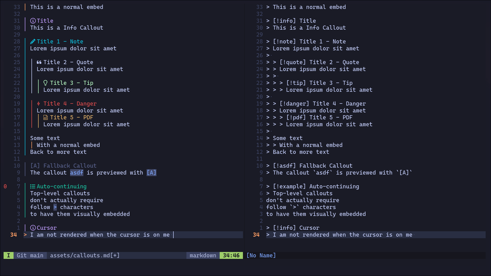

# `better-callouts.nvim`

Render callouts in Neovim

## Setup

Example Lazy.nvim config at `~/.config/nvim/lua/plugins/better-callouts.lua`

```lua
return {
  'mastertemple/better-callouts.nvim',
  ft = 'markdown', -- Lazy-load only for markdown filetypes

  opts = {
    -- This is where you override the default options.
    callouts = {
      bible = {
        icon = '',
        highlight = '@label',
      },
    },
    -- Default embed color
    embed_color = '@none',
    -- You can provide your own fallback function.
    fallback = function(name)
      -- Let's create a more dynamic fallback
      local first_char = string.sub(name, 1, 1):upper()
      return {
        icon = '[' .. first_char .. ']',
        highlight = 'Comment',
      }
    end,
  },

  -- The `config` function is executed after the plugin is loaded.
  -- It's the standard way to call a plugin's setup function.
  config = function(_, opts)
    require('better-callouts').setup(opts)
  end,
}
```

## Screenshots

Example rendering:



## TODO

1. Fix embeded callouts `> > [!quote]` (This is not because I am starting from `^> `, but rather because I am in the "remaining lines loop"); The solution is to render all embeds and all callout titles separately
2. Fix visual selection preview
